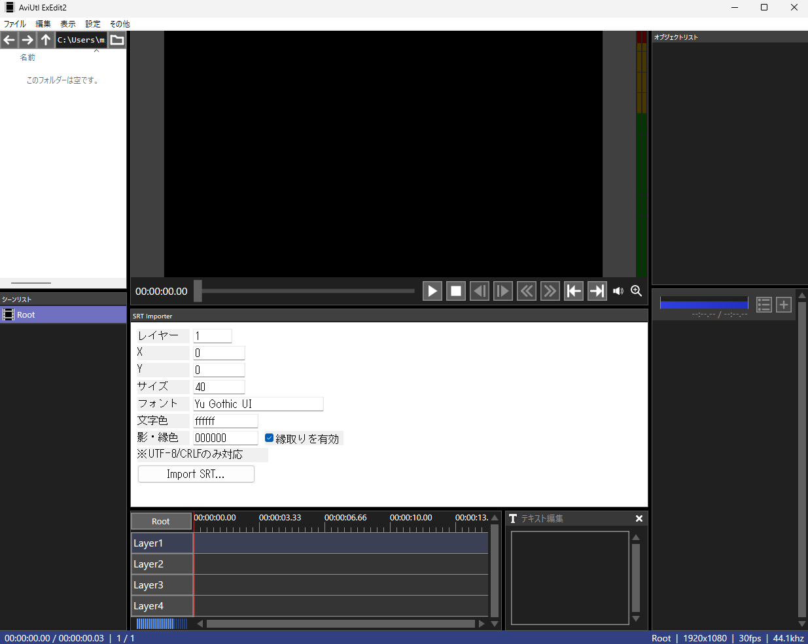

# SRT Importer Plugin for AviUtl 2

このプラグインは、AviUtl ExEdit2でSRT字幕ファイルをインポートするためのプラグインです。本体の使い方については公式HPを参照してください。

公式HP：[AviUtlのお部屋](https://spring-fragrance.mints.ne.jp/aviutl/)


## 機能

- SRTファイルを参照して、テキストオブジェクトとして指定レイヤーにインポートできます。現在、文字のエンコーディングはUTF-8/CRLFのみ対応しています。
- AviUtl ExEdit2 beta24aにて起動確認しています。

## 使用方法

1. Releaseページから、SrtImporter.aux2をダウンロードしてください
2. プラグインをAviUtlにインストールします。インストール方法は、環境によって異なりますが、多くの場合上記ファイルを次の位置にコピーして起動するだけです。

    SrtImporter.aux2を次の位置にコピー<br>
    ```C:\ProgramData\aviutl2\Plugin```

3. 本体を起動し、「表示」から「SRT Importer」をチェックを入れます。次のような画面になります。

    

    中央にあるのがプラグイン本体です。初回起動時は小さく畳んであることがあるので、ドラックしてウィンドウを広げてください。

4. SRTファイルをインポートする前に、必要に応じてレイヤー、位置、フォント、色などを設定します。インポートしたあとの変更はテキストオブジェクトごとの変更となります。
6. 「Import SRT...」ボタンをクリックしてインポートを実行します。

## 対応形式

- 文字エンコーディング: UTF-8
- 改行コード: CRLF
- 時間形式: 00:00:00,000

## 注意事項

- 時刻からフレームへの変換は切り捨てられます。
- CR/LF混在のファイルには対応していません。
- GUIからの設定はインポート時に適用されます。

## ビルド

AviUtl ExEdit2 beta24aのSDKを使用しています。
ビルドはw64devkitとCMakeを使用しています。

VSCode上で.vscode/tasks.jsonを設定し、ビルドが可能です。
環境によってパラメータが異なるので参考にしてください。

tasks.json
```
{
  "version": "2.0.0",
  "tasks": [
    {
      "label": "cmake configure (w64devkit)",
      "type": "process",
      "command": "C:\\Program Files\\CMake\\bin\\cmake.exe",
      "args": [
        "-S", ".",
        "-B", "build",
        "-G", "MinGW Makefiles",
        "-DCMAKE_C_COMPILER=gcc",
        "-DCMAKE_CXX_COMPILER=g++",
        "-DCMAKE_BUILD_TYPE=Release"
      ],
      "options": {
        "cwd": "${workspaceFolder}",
        "env": {
          "PATH": "C:\\w64devkit\\bin;${env:PATH}"
        }
      }
    },
    {
      "label": "cmake build (w64devkit)",
      "type": "process",
      "command": "C:\\Program Files\\CMake\\bin\\cmake.exe",
      "args": [
        "--build", "build", "--config", "Release"
      ],
      "options": {
        "cwd": "${workspaceFolder}",
        "env": {
          "PATH": "C:\\w64devkit\\bin;${env:PATH}"
        }
      },
      "dependsOn": ["cmake configure (w64devkit)"],
      "group": { "kind": "build", "isDefault": true }
    }
  ]
}
```